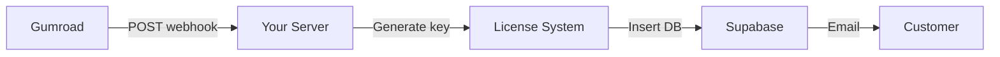

# License Activation Workflow

Complete guide for license activation in AiChemist Transmutation Codex - covering both development testing and production customer workflows.

---

## 📋 Table of Contents

- [Overview](#overview)
- [Development Testing Workflow](#development-testing-workflow)
- [Production Customer Workflow](#production-customer-workflow)
- [Troubleshooting](#troubleshooting)

---

## Overview

AiChemist Transmutation Codex uses a **hybrid license validation system**:

1. **Online Validation (Primary)**: Licenses are verified against Supabase database
2. **Offline Validation (Fallback)**: RSA signature verification works without internet

### License Flow

```
Customer Purchase → Gumroad → Webhook → Generate License → Insert Supabase → Email to Customer
                                                                    ↓
Customer Paste Key → App → Check Supabase → Validate → Activate → Save Locally
```

---

## Development Testing Workflow

Use this workflow when testing the license activation feature during development.

### Step 1: Generate Test License Key

```powershell
# Navigate to project root
cd D:\Coding\AiChemistCodex\AiChemistTransmutations

# Generate dev license (creates DEV_LICENSE.txt)
python scripts/licensing/generate_dev_license.py --print-only
```

**Output**: Creates `DEV_LICENSE.txt` with a test license key like:

```
AICHEMIST:T/nUi8R7rx5PJjRsx2YAfUUVgywuCabYKME5dkjTk7nh5QnlRpQY2YvWiPEu65pf...
```

### Step 2: Set Up Supabase Credentials

```powershell
# Get credentials from: https://supabase.com/dashboard
# Project Settings > API

# Set environment variables (PowerShell)
$env:SUPABASE_URL="https://your-project.supabase.co"
$env:SUPABASE_SERVICE_KEY="your-service-role-key-here"

# Or create .env file in project root:
# SUPABASE_URL=https://your-project.supabase.co
# SUPABASE_SERVICE_KEY=your-service-role-key
```

**Important**: Use the **SERVICE ROLE KEY** (not the anon key) for license generation.

### Step 3: Insert License into Supabase

```powershell
# This inserts the key from DEV_LICENSE.txt into your Supabase database
python scripts/licensing/insert_test_license.py
```

The script will:

- ✅ Read the license key from `DEV_LICENSE.txt`
- ✅ Check if a dev license already exists
- ✅ Insert the license into Supabase `licenses` table
- ✅ Display the database record ID

### Step 4: Test in Your App

```powershell
# Run the installed app
cd gui\release\1.0.0\win-unpacked
.\AiChemist Transmutation Codex.exe

# Or from Start Menu: "AiChemist"
```

**In the app:**

1. Click **"Activate License"** button
2. **Paste the license key** from `DEV_LICENSE.txt`:

   ```
   AICHEMIST:T/nUi8R7rx5PJjRsx2YAfUUVgywuCabYKME5dkjTk7nh5QnlRpQY2YvWiPEu65pf...
   ```

3. Click **"Activate"**
4. ✅ Should show **"Licensed"** or **"Pro"** status
5. ✅ Restart app - license persists
6. ✅ Check About/Settings - shows "Enterprise"

### Step 5: Verify Activation in Supabase

**Check Supabase Dashboard:**

- Go to: **Table Editor > activations**
- Should see new activation record with:
  - `license_id`: Foreign key to your license
  - `machine_id`: Unique fingerprint of your computer
  - `activated_at`: Timestamp
  - `is_active`: `true`

---

## Production Customer Workflow

This is the workflow for paying customers purchasing from Gumroad.

### Step 1: Customer Purchases on Gumroad

1. Customer visits: `https://aichemist.gumroad.com/l/transmutation-codex`
2. Completes purchase ($49 or chosen price)
3. Gumroad processes payment

### Step 2: Webhook Generates License



**Webhook endpoint** (you need to deploy):

```python
# scripts/gumroad/webhook_server.py
@app.post("/webhook/gumroad")
async def handle_gumroad_webhook(request: Request):
    # 1. Verify webhook signature
    # 2. Extract customer email
    # 3. Generate license key
    # 4. Insert into Supabase
    # 5. Send email with license
```

**See**: `docs/GUMROAD_COMPLETE_SETUP.md` for webhook deployment

### Step 3: Customer Receives License

Customer gets an email with:

```
Subject: Your AiChemist Transmutation Codex License

Thank you for your purchase!

License Key:
AICHEMIST:Hg8Kj2Lp9mN4oQ5rS6tU7vW8xY9zA0bC1dE2fG3hI4jK5lM6nO7pQ8rS9tU0vW1xY2z...

Instructions:
1. Download AiChemist Transmutation Codex
2. Install the application
3. Click "Activate License"
4. Paste your license key
5. Enjoy unlimited conversions!

Support: support@aichemist.com
```

### Step 4: Customer Activates in App

**Customer side:**

1. Download installer from Gumroad (or your site)
2. Install application
3. Launch **AiChemist Transmutation Codex**
4. Click **"Activate License"**
5. Paste license key
6. Click **"Activate"**

**Behind the scenes:**

```python
# gui/src/main/main.ts calls:
# src/transmutation_codex/adapters/bridges/license_bridge.py

# Which calls:
# src/transmutation_codex/core/licensing/license_manager.py

# Which does:
1. Validate license format (RSA signature)
2. Check Supabase for license record
3. Verify status (active, not expired)
4. Check activation count < max_activations
5. Generate machine fingerprint
6. Record activation in Supabase
7. Save license locally to AppData
8. Return success
```

### Step 5: License Validation (Every App Start)

**On app startup:**

```python
# Check local license file
license_data = load_license_from_appdata()

if license_data:
    # Online validation (if internet available)
    if supabase_online:
        verify_license_with_supabase(license_data["license_key"])
        check_not_revoked()

    # Offline validation (fallback)
    verify_rsa_signature(license_data["license_key"])
    check_expiry_date(license_data)

    return "Licensed"
else:
    return "Trial" (50 conversions)
```

---

## Troubleshooting

### Error: "License command failed with code 1"

**What "code 1" means**: Exit code 1 is a general error code from the Python process. The actual error message is in the stderr output or JSON response.

**Common Causes**:

1. **Invalid license key**: RSA signature validation failed
2. **License activation limit reached**: Maximum number of activations exceeded
3. **Import error**: Python can't find the `transmutation_codex` package
4. **Validation error**: License expired, revoked, or malformed

**How to Debug**:

1. **Check Electron DevTools Console** (if running in dev mode):
   - Open DevTools: `Ctrl+Shift+I` (Windows) or `Cmd+Option+I` (Mac)
   - Look for `[PYTHON STDERR]` messages - these contain the actual error
   - Look for `[PYTHON STDOUT]` - may contain JSON with error details

2. **Check Python Logs**:
   ```powershell
   # License bridge logs go to stderr, check Electron console
   # Or check Python session logs:
   Get-Content logs/python/app_session_*.log | Select-String -Pattern "LICENSE_BRIDGE|Activation"
   ```

3. **Test License Key Directly**:
   ```powershell
   python -m transmutation_codex.adapters.bridges.license_bridge activate "YOUR_LICENSE_KEY"
   ```

4. **Common Error Messages**:
   - `"Invalid license key"` → Check key format, no extra spaces
   - `"Cannot activate license: max_activations_reached"` → Deactivate on other devices
   - `"Import error: No module named 'transmutation_codex'"` → Package not installed correctly
   - `"License expired"` → License has passed expiry date

**Solution Steps**:

1. Copy the exact error message from DevTools console (stderr output)
2. Verify license key format: Should start with `AICHEMIST:` and be one continuous string
3. Check if license is already activated: Try deactivating first
4. For development: Ensure Python environment is activated and package is installed (`pip install -e .`)

### Error: "License command failed with code 2"

**Cause**: License key is not in Supabase database

**Solution**:

1. Verify key was inserted: Check Supabase Table Editor > `licenses`
2. Re-insert key: `python scripts/licensing/insert_test_license.py`
3. Check Supabase credentials: `$env:SUPABASE_URL` and `$env:SUPABASE_SERVICE_KEY`

### Error: "Invalid license key"

**Cause**: License key format is incorrect or RSA signature doesn't match

**Solution**:

1. Check key starts with `AICHEMIST:`
2. Ensure no extra spaces or line breaks when pasting
3. Verify key was generated with correct private key
4. Check `scripts/.keys/private_key.pem` matches the public key in app

### Error: "License already activated on maximum devices"

**Cause**: License has reached `max_activations` limit

**Solution** (Admin):

1. Go to Supabase Dashboard > Table Editor > `activations`
2. Find activations for this `license_id`
3. Delete old activation records
4. Or increase `max_activations` in `licenses` table

### App Shows "Trial Mode" After Activation

**Causes**:

1. License not saved to AppData correctly
2. App can't read license file
3. Supabase backend not configured

**Solution**:

1. Check license file exists:
   - Windows: `%APPDATA%\AiChemist\license.json`
   - macOS: `~/Library/Application Support/AiChemist/license.json`
   - Linux: `~/.local/share/aichemist/license.json`
2. Check file contents (should be valid JSON)
3. Check app logs: `logs/python/app_session_*.log`
4. Verify Supabase environment variables in production build

### Webhook Not Receiving Gumroad Events

**Solution**:

1. Verify webhook URL in Gumroad settings
2. Check webhook server is running and accessible
3. Test with Gumroad's "Ping" feature
4. Check webhook server logs
5. Verify SSL certificate (Gumroad requires HTTPS)

**See**: `docs/GUMROAD_COMPLETE_SETUP.md` for webhook troubleshooting

---

## Database Schema

### `licenses` Table

```sql
CREATE TABLE licenses (
    id BIGSERIAL PRIMARY KEY,
    email TEXT NOT NULL,
    license_key TEXT NOT NULL UNIQUE,
    type TEXT NOT NULL, -- 'basic', 'pro', 'enterprise'
    status TEXT NOT NULL, -- 'active', 'revoked', 'expired'
    max_activations INTEGER NOT NULL DEFAULT 3,
    expires_at TIMESTAMP WITH TIME ZONE,
    metadata JSONB DEFAULT '{}'::jsonb,
    created_at TIMESTAMP WITH TIME ZONE DEFAULT NOW(),
    updated_at TIMESTAMP WITH TIME ZONE DEFAULT NOW()
);
```

### `activations` Table

```sql
CREATE TABLE activations (
    id BIGSERIAL PRIMARY KEY,
    license_id BIGINT REFERENCES licenses(id) ON DELETE CASCADE,
    machine_id TEXT NOT NULL,
    machine_name TEXT,
    is_active BOOLEAN DEFAULT TRUE,
    activated_at TIMESTAMP WITH TIME ZONE DEFAULT NOW(),
    last_seen TIMESTAMP WITH TIME ZONE DEFAULT NOW(),
    metadata JSONB DEFAULT '{}'::jsonb,
    UNIQUE(license_id, machine_id)
);
```

---

## Security Notes

### Private Key Protection 🔐

**CRITICAL**: The private key (`scripts/.keys/private_key.pem`) must NEVER be committed to version control or shared publicly.

- ✅ Store in password manager
- ✅ Use separate keys for dev/test/production
- ✅ Backup securely (encrypted storage)
- ❌ Never commit to Git
- ❌ Never email or share via chat
- ❌ Never embed in client-side code

### Public Key Embedding

The **public key** is safe to embed in the application:

```python
# src/transmutation_codex/core/licensing/crypto.py
DEFAULT_PUBLIC_KEY = """
-----BEGIN PUBLIC KEY-----
MIIBIjANBgkqhkiG9w0BAQEFAAOCAQ8AMIIBCgKCAQEA...
-----END PUBLIC KEY-----
"""
```

This allows offline license validation without internet.

### Supabase Security

**Service Role Key** (SECRET):

- ✅ Use for license generation (server-side only)
- ✅ Store in environment variables
- ❌ Never embed in client app

**Anon Key** (PUBLIC):

- ✅ Safe to embed in client app
- ✅ Use for license validation
- ✅ Protected by Row Level Security (RLS) policies

---

## Next Steps

### For Development Testing

1. ✅ Generate test license: `python scripts/licensing/generate_dev_license.py --print-only`
2. ✅ Set Supabase credentials: `$env:SUPABASE_URL` and `$env:SUPABASE_SERVICE_KEY`
3. ✅ Insert into Supabase: `python scripts/licensing/insert_test_license.py`
4. ✅ Test in app: Activate and verify

### For Production Launch

1. ✅ Deploy webhook server: See `docs/GUMROAD_COMPLETE_SETUP.md`
2. ✅ Configure Gumroad webhook: Point to your server
3. ✅ Test purchase flow: Use Gumroad test mode
4. ✅ Set up email delivery: Gumroad or custom SMTP
5. ✅ Monitor Supabase: Check activations and logs

---

## Support

For issues or questions:

- **Email**: <support@aichemist.com>
- **Documentation**: `docs/`
- **Gumroad Setup**: `docs/GUMROAD_COMPLETE_SETUP.md`
- **Supabase Setup**: `scripts/setup/supabase_setup.sql`

---

**Last Updated**: October 2025
**Version**: 1.0.0
